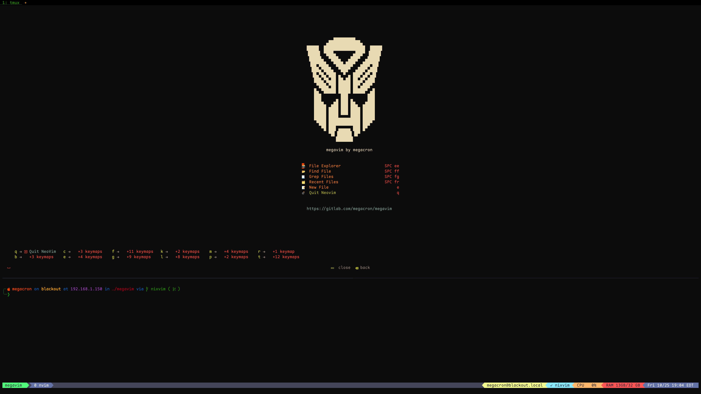
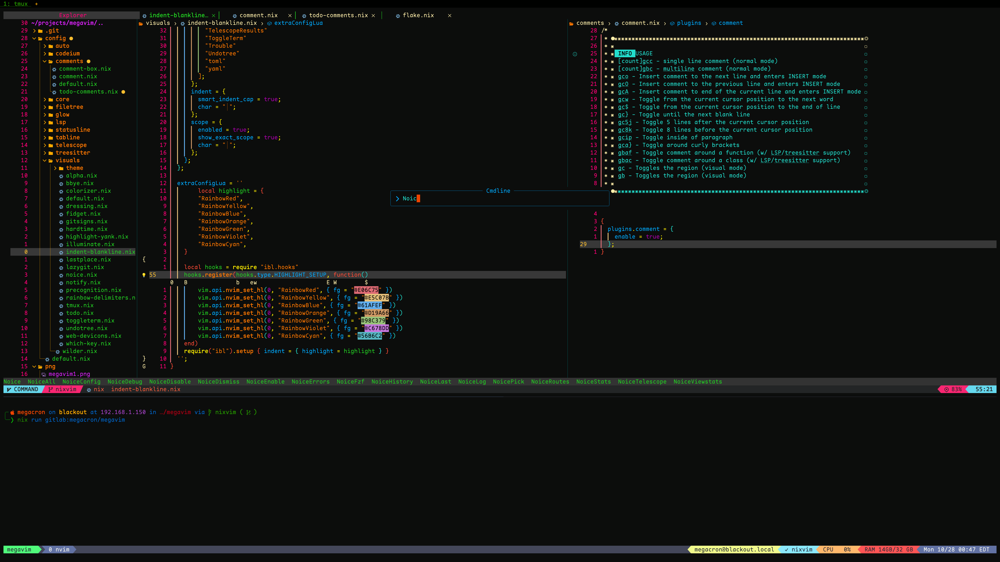
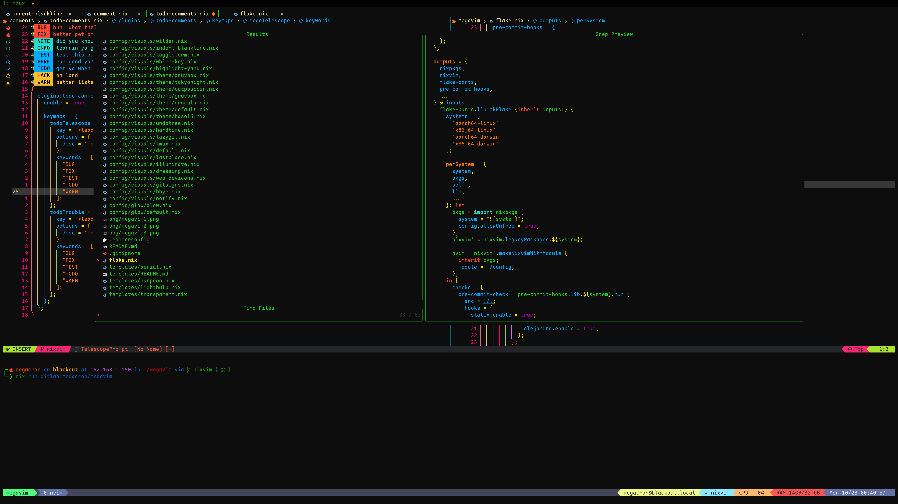

## :punch: Thank You!!

> - :snowflake: [nixvim](https://github.com/nix-community/nixvim) && community!
> - :snowflake: [siph](https://github.com/siph/nixvim-flake)
> - :snowflake: [elythh](https://github.com/elythh/nixvim/tree/main)
> - :snowflake: [gwg313](https://github.com/gwg313/nvim-nix/tree/main/config)
> - :snowflake: [MikaelFangel](https://github.com/MikaelFangel/nixvim-config/blob/main/README.md)
> - :snowflake: [solid-sinusoid](https://github.com/solid-sinusoid/nixvim-config/tree/main)

## :city_sunset: Preview

  
  


## :book: Resources

> [RTFM](https://nix-community.github.io/nixvim/)  
> [NüschtOS](https://nix-community.github.io/nixvim/search/)  
> [NVIM Options](https://neovim.io/doc/user/options.html#)

## :electric_plug: Features

> AI: Choose from Code Companion or Opencode (default). These will hook into most models.
> Hardtime: For forcing you to learn vim, and get hint of better ways.  
> Precognition: For vim suggestions if you are learing vim motions.  
> Glow: To toggle markdown preview.  
> LazyGit: For easy git management.  
> Linting, formatting, syntax highlighting, etc...for most languages.  
> Keep context for deeply nested code.

> A Nix version of Neovim.  
> Nixvim input is locked to prevent breaking changes but updated every few months.

## :speed: Quick Start

> To make your own changes to customize to YOUR needs:

- Fork the repo
- Clone the fork
- Make your changes ( comment out/in plugins, change colorscheme, keybindings, etc. )
- add your fork to your inputs in your own flake.nix
- or use stand alone with a nix run git{hub|lab}:username/branch of your fork

## :joystick: Commands

> Just to list to make you aware of them.  
> For the bufferline tabs use alt+h | alt+l to toggle between tabs.  
> Open a file into a vertical split use ctrl+v.  
> These commands are also used with spacebar menu list.

```vim
:h holy-grail                   # see everything vim can do
:Telescope keymaps              # search set keymaps
```

## :nut_and_bolt: How to Run

> If nix is installed on your system you can try megavim from either gitlab or github:

```shell
nix run gitlab:megacron/megavim

nix run github:octocron/megavim
```

## :floppy_disk: Direct Install

> You can also plug this into a flake to include it into a system configuration.  
> If you fork, follow the same instructions but replace the url to your fork.  
> Make sure that neovim is UNINSTALLED!! Otherwise megavim cannot set itself as default!

```nix
# flake.nix use with ref to ensure it pulls from the correct branch with latest.
{
  inputs = {
    megavim.url = "gitlab:megacron/megavim?ref=nixvim";
  };
}
```

```nix
# configuration.nix // choose either NixOS or home-manager
{ inputs, system, ... }:
{
  # NixOS
  environment.systemPackages = [ inputs.megavim.packages.${pkgs.system}.default ];
  # home-manager
  home.packages = [ inputs.megavim.packages.${pkgs.system}.default ];
}
```

> When installed this way there may come a time you want to update megavim without  
> updating the whole system (flake). We can pick a single input this way:

```zsh
# Check for and update only megavim
nix flake lock --update-input megavim

# if the lock file update just do a rebuild
sudo nixos-rebuild switch --flake ~/some/path/
```

## :pushpin: Overlay

> This input can then be used as an overlay to replace the default neovim.  
> This means that we DO install neovim, then overlay it.

```nix
{ megavim, ... }:
{
  overlays = (final: prev: {
    neovim = megavim.packages.${prev.system}.default;
  });
}
```

## :crystal_ball: In devShell

```nix
devShells.default = nixpkgs.mkShell {
  nativeBuildInputs = [ megavim.packages.${pkgs.system}.default ];
};
```

> You can find more information on building your own flake  
> [here](https://gist.github.com/siph/288b7c6b5f68a1902d28aebc95fde4c5).
