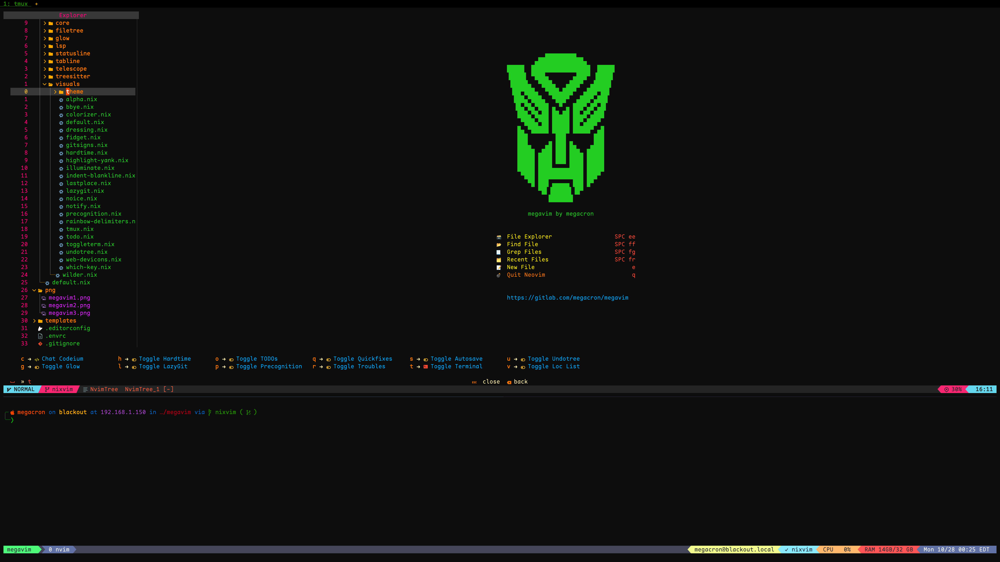

## :punch: Thank You!!

> - :snowflake: [nixvim](https://github.com/nix-community/nixvim) && community!
> - :snowflake: [siph](https://github.com/siph/nixvim-flake)
> - :snowflake: [elythh](https://github.com/elythh/nixvim/tree/main)
> - :snowflake: [gwg313](https://github.com/gwg313/nvim-nix/tree/main/config)
> - :snowflake: [MikaelFangel](https://github.com/MikaelFangel/nixvim-config/blob/main/README.md)
> - :snowflake: [solid-sinusoid](https://github.com/solid-sinusoid/nixvim-config/tree/main)

## :picture: Preview
  
  
  

## :book: Resources

> [RTFM](https://nix-community.github.io/nixvim/)  
> [NüschtOS](https://nix-community.github.io/nixvim/search/)  
> [NVIM Options](https://neovim.io/doc/user/options.html#)

## :electric_plug: Features

> Codium: with ability to connect project context to your account.  
> Hardtime: For forcing you to learn vim, and get hint of better ways.  
> Precognition: For vim suggestions.  
> Glow: To toggle markdown preview.  
> LazyGit: For easy git management.  
> Linting, formatting, syntax highlighting, etc...for most languages.  
> Keep context for deeply nested code.

> A Nix version of Neovim.  
> <nixvim> is locked to prevent breaking changes.

## :joystick: Commands

> These commands are also used with spacebar menu list.  
> Just to list to make you aware of them.

```vim
:h holy-grail                   # see everything vim can do
:Telescope keymaps              # search set keymaps
```

## :nut_and_bolt: How to Run

> You can run this directly from the command line with:

```shell
nix run gitlab:megacron/megavim
```

## :floppy_disk: Direct Install

> You can also plug this into a flake to include it into a system configuration.  
> Make sure that neovim is UNINSTALLED!! Otherwise megavim cannot set itself as default!

```nix
# flake.nix need commitHash in order to guarantee proper build so be sure to paste in latest commit
{
  inputs = {
    # without commitHashLatest megavim would build from flake source instead of its own
    megavim.url = "gitlab:megacron/megavim?rev=commitHashLatest";
  };
}
```

```nix
# configuration.nix
{ inputs, system, ... }:
{
  # NixOS
  environment.systemPackages = [ inputs.megavim.packages.${pkgs.system}.default ];
  # home-manager
  home.packages = [ inputs.megavim.packages.${pkgs.system}.default ];
}
```

## :pushpin: Overlay

> This input can then be used as an overlay to replace the default neovim.  
> This means that we DO install neovim, then overlay it.

```nix
{ megavim, ... }:
{
    overlays = (final: prev: {
      neovim = megavim.packages.${prev.system}.default;
    });
}
```

## :crystal_ball: In devShell

```nix
 devShells.default = nixpkgs.mkShell {
        nativeBuildInputs = [ megavim.packages.${pkgs.system}.default ];
      };
    };
```

> You can find more information on building your own flake  
> [here](https://gist.github.com/siph/288b7c6b5f68a1902d28aebc95fde4c5).
